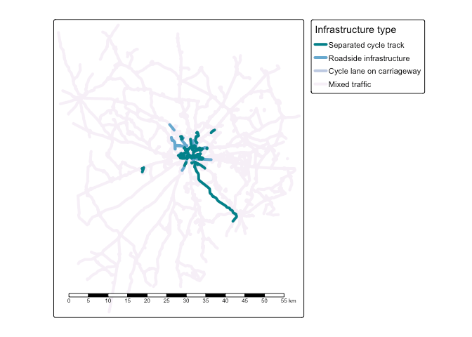
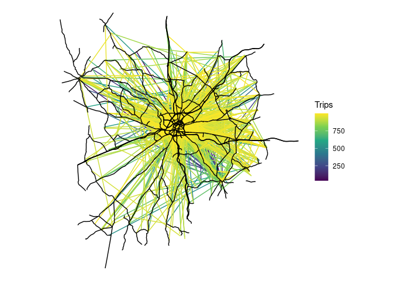

<!-- badges: start -->

[](https://github.com/Robinlovelace/spanish_od_data/actions/workflows/R-CMD-check.yaml)
<!-- badges: end -->

This repo demonstrates how to download and use OD data from Spain,
published by
[transportes.gob.es](https://www.transportes.gob.es/ministerio/proyectos-singulares/estudios-de-movilidad-con-big-data/opendata-movilidad)

The data is provided as follows:

- Estudios basicos
  - Por disitritos
    - Personas (population)
    - Pernoctaciones (overnight stays)
    - Viajes
      - ficheros-diarios
      - meses-completos

The package is designed to save people time by providing the data in
analyis-ready formats. Automating the process of downloading, cleaning
and importing the data can also reduce the risk of errors in the
laborious process of data preparation.

The datasets are large, so the package aims to reduce computational
resources, by using computationally efficient packages behind the
scenes. If you want to use many of the data files, it’s recommended you
set a data directory where the package will look for the data, only
downloading the files that are not already present.

# Installation

Install the package as follows:

``` r
if (!require("remotes")) install.packages("remotes")
remotes::install_github("Robinlovelace/spanishoddata")
```

Load it as follows:

``` r
library(spanishoddata)
```

Local development: to load the package locally, clone it and navigate to
the root of the package in the terminal, e.g. with the following:

``` bash
gh repo clone Robinlovelace/spanishoddata
code spanishoddata
```

then run the following command from the R console:

``` r
devtools::load_all()
```

# Setting the data directory

You can specify the data directory globally by setting the
`SPANISH_OD_DATA_DIR` environment variable, e.g. with the following
command:

``` r
usethis::edit_r_environ()
# Then set the data directory globally, by typing this line in the file:
```

    SPANISH_OD_DATA_DIR = "/path/to/data"

You can also set the data directory in the local folder by editing a
local `.Renviron` file in the root of the project:

``` r
file.edit(".Renviron")
```

Finally, you can set the data directory in the current R session as
follows:

``` r
Sys.setenv(SPANISH_OD_DATA_DIR = "/path/to/data")
```

# Using the package

To run the code in this README we will use the following setup:

``` r
library(duckdb)
library(tidyverse)
theme_set(theme_minimal())
sf::sf_use_s2(FALSE)
```

Get metadata for the datasets as follows:

``` r
metadata = spod_available_data_v2()
metadata
```

    # A tibble: 9,442 × 6
       target_url           pub_ts              file_extension data_ym data_ymd  
       <chr>                <dttm>              <chr>          <date>  <date>    
     1 https://movilidad-o… 2024-07-30 10:54:08 gz             NA      2022-10-23
     2 https://movilidad-o… 2024-07-30 10:51:07 gz             NA      2022-10-22
     3 https://movilidad-o… 2024-07-30 10:47:52 gz             NA      2022-10-20
     4 https://movilidad-o… 2024-07-30 10:14:55 gz             NA      2022-10-18
     5 https://movilidad-o… 2024-07-30 10:11:58 gz             NA      2022-10-17
     6 https://movilidad-o… 2024-07-30 10:09:03 gz             NA      2022-10-12
     7 https://movilidad-o… 2024-07-30 10:05:57 gz             NA      2022-10-07
     8 https://movilidad-o… 2024-07-30 10:02:12 gz             NA      2022-08-07
     9 https://movilidad-o… 2024-07-30 09:58:34 gz             NA      2022-08-06
    10 https://movilidad-o… 2024-07-30 09:54:30 gz             NA      2022-08-05
    # ℹ 9,432 more rows
    # ℹ 1 more variable: local_path <chr>

## Zones

Zones can be downloaded as follows:

``` r
distritos = spod_get_zones_v2("distritos")
distritos_wgs84 = sf::st_transform(distritos, 4326)
plot(distritos_wgs84)
```


## Estudios basicos

Each day in the `ficheros-diarios` folder contains a file with the
following columns:

``` r
# set timeout for downloads
options(timeout = 600) # 10 minutes
u1 = "https://movilidad-opendata.mitma.es/estudios_basicos/por-distritos/viajes/ficheros-diarios/2024-03/20240301_Viajes_distritos.csv.gz"
f1 = basename(u1)
if (!file.exists(f1)) {
  download.file(u1, f1)
}
drv = duckdb::duckdb("daily.duckdb")
con = DBI::dbConnect(drv)
od1 = duckdb::tbl_file(con, f1)
# colnames(od1)
#  [1] "fecha"                   "periodo"                
#  [3] "origen"                  "destino"                
#  [5] "distancia"               "actividad_origen"       
#  [7] "actividad_destino"       "estudio_origen_posible" 
#  [9] "estudio_destino_posible" "residencia"             
# [11] "renta"                   "edad"                   
# [13] "sexo"                    "viajes"                 
# [15] "viajes_km"
od1_head = od1 |>
  head() |>
  collect()
od1_head |>
  knitr::kable()
```

| fecha | periodo | origen | destino | distancia | actividad_origen | actividad_destino | estudio_origen_posible | estudio_destino_posible | residencia | renta | edad | sexo | viajes | viajes_km |
|---:|:---|:---|:---|:---|:---|:---|:---|:---|:---|:---|:---|:---|---:|---:|
| 20240301 | 19 | 01009_AM | 01001 | 0.5-2 | frecuente | casa | no | no | 01 | 10-15 | NA | NA | 5.124 | 6.120 |
| 20240301 | 15 | 01002 | 01001 | 10-50 | frecuente | casa | no | no | 01 | 10-15 | NA | NA | 2.360 | 100.036 |
| 20240301 | 00 | 01009_AM | 01001 | 10-50 | frecuente | casa | no | no | 01 | 10-15 | NA | NA | 1.743 | 22.293 |
| 20240301 | 05 | 01009_AM | 01001 | 10-50 | frecuente | casa | no | no | 01 | 10-15 | NA | NA | 2.404 | 24.659 |
| 20240301 | 06 | 01009_AM | 01001 | 10-50 | frecuente | casa | no | no | 01 | 10-15 | NA | NA | 5.124 | 80.118 |
| 20240301 | 09 | 01009_AM | 01001 | 10-50 | frecuente | casa | no | no | 01 | 10-15 | NA | NA | 7.019 | 93.938 |

``` r
DBI::dbDisconnect(con)
```

You can get the same result, but for multiple files, as follows:

``` r
od_multi_list = spod_get(
  subdir = "estudios_basicos/por-distritos/viajes/ficheros-diarios",
  date_regex = "2024030[1-7]"
)
od_multi_list[[1]]
```

    # Source:   SQL [?? x 15]
    # Database: DuckDB v1.0.0 [robin@Linux 6.5.0-45-generic:R 4.4.1/:memory:]
          fecha periodo origen  destino distancia actividad_origen actividad_destino
          <dbl> <chr>   <chr>   <chr>   <chr>     <chr>            <chr>            
     1 20240307 00      01009_… 01001   0.5-2     frecuente        casa             
     2 20240307 09      01009_… 01001   0.5-2     frecuente        casa             
     3 20240307 18      01009_… 01001   0.5-2     frecuente        casa             
     4 20240307 19      01009_… 01001   0.5-2     frecuente        casa             
     5 20240307 20      01009_… 01001   0.5-2     frecuente        casa             
     6 20240307 14      01002   01001   10-50     frecuente        casa             
     7 20240307 22      01002   01001   10-50     frecuente        casa             
     8 20240307 06      01009_… 01001   10-50     frecuente        casa             
     9 20240307 09      01009_… 01001   10-50     frecuente        casa             
    10 20240307 11      01009_… 01001   10-50     frecuente        casa             
    # ℹ more rows
    # ℹ 8 more variables: estudio_origen_posible <chr>,
    #   estudio_destino_posible <chr>, residencia <chr>, renta <chr>, edad <chr>,
    #   sexo <chr>, viajes <dbl>, viajes_km <dbl>

``` r
class(od_multi_list[[1]])
```

    [1] "tbl_duckdb_connection" "tbl_dbi"               "tbl_sql"              
    [4] "tbl_lazy"              "tbl"                  

The result is a list of duckdb tables which load almost instantly, and
can be used with dplyr functions. Let’s do an aggregation to find the
total number trips per hour over the 7 days:

``` r
n_per_hour = od_multi_list |>
  map(~ .x |>
        group_by(periodo, fecha) |>
        summarise(n = n(), Trips = sum(viajes)) |>
        collect()
  ) |>
  list_rbind() |>
  mutate(Time = lubridate::ymd_h(paste0(fecha, periodo))) |>
  mutate(Day = lubridate::wday(Time, label = TRUE)) 
n_per_hour |>
  ggplot(aes(x = Time, y = Trips)) +
  geom_line(aes(colour = Day)) +
  labs(title = "Number of trips per hour over 7 days")
```


The figure above summarises 925,874,012 trips over the 7 days associated
with 135,866,524 records.

# Desire lines

We’ll use the same input data to pick-out the most important flows in
Spain, with a focus on longer trips for visualisation:

``` r
od_large = od_multi_list |>
  map(~ .x |>
        group_by(origen, destino) |>
        summarise(Trips = sum(viajes), .groups = "drop") |>
        filter(Trips > 500) |>
        collect()
  ) |>
  list_rbind() |>
  group_by(origen, destino) |>
  summarise(Trips = sum(Trips)) |>
  arrange(desc(Trips))
od_large
```

    # A tibble: 37,023 × 3
    # Groups:   origen [3,723]
       origen  destino    Trips
       <chr>   <chr>      <dbl>
     1 2807908 2807908 2441404.
     2 0801910 0801910 2112188.
     3 0801902 0801902 2013618.
     4 2807916 2807916 1821504.
     5 2807911 2807911 1785981.
     6 04902   04902   1690606.
     7 2807913 2807913 1504484.
     8 2807910 2807910 1299586.
     9 0704004 0704004 1287122.
    10 28106   28106   1286058.
    # ℹ 37,013 more rows

The results show that the largest flows are intra-zonal. Let’s keep only
the inter-zonal flows:

``` r
od_large_interzonal = od_large |>
  filter(origen != destino)
```

We can convert these to geographic data with the {od} package:

``` r
od_large_interzonal_sf = od::od_to_sf(
  od_large_interzonal,
  z = distritos_wgs84
)
od_large_interzonal_sf |>
  ggplot() +
  geom_sf(aes(size = Trips), colour = "red") +
  theme_void()
```


Let’s focus on trips in and around a particular area (Salamanca):

``` r
salamanca_zones = zonebuilder::zb_zone("Salamanca")
distritos_salamanca = distritos_wgs84[salamanca_zones, ]
plot(distritos_salamanca)
```


We will use this information to subset the rows, to capture all movement
within the study area:

``` r
ids_salamanca = distritos_salamanca$ID
od_salamanca = od_multi_list |>
  map(~ .x |>
        filter(origen %in% ids_salamanca) |>
        filter(destino %in% ids_salamanca) |>
        collect()
  ) |>
  list_rbind() |>
  group_by(origen, destino) |>
  summarise(Trips = sum(viajes)) |>
  arrange(Trips)
```

Let’s plot the results:

``` r
od_salamanca_sf = od::od_to_sf(
  od_salamanca,
  z = distritos_salamanca
)
od_salamanca_sf |>
  filter(origen != destino) |>
  ggplot() +
  geom_sf(aes(colour = Trips), size = 1) +
  scale_colour_viridis_c() +
  theme_void()
```


# Disaggregating desire lines

For this you’ll need some additional dependencies:

``` r
library(sf)
library(tmap)
```

We’ll get the road network from OSM:

``` r
salamanca_boundary = sf::st_union(distritos_salamanca)
osm_full = osmactive::get_travel_network(salamanca_boundary)
```

``` r
osm = osm_full[salamanca_boundary, ]
drive_net = osmactive::get_driving_network(osm)
drive_net_major = osmactive::get_driving_network_major(osm)
cycle_net = osmactive::get_cycling_network(osm)
cycle_net = osmactive::distance_to_road(cycle_net, drive_net_major)
cycle_net = osmactive::classify_cycle_infrastructure(cycle_net)
map_net = osmactive::plot_osm_tmap(cycle_net)
map_net
```



We can use the road network to disaggregate the desire lines:

``` r
od_jittered = odjitter::jitter(
  od_salamanca_sf,
  zones = distritos_salamanca,
  subpoints = drive_net,
  disaggregation_threshold = 1000,
  disaggregation_key = "Trips"
)
```

Let’s plot the disaggregated desire lines:

``` r
od_jittered |>
  arrange(Trips) |>
  ggplot() +
  geom_sf(aes(colour = Trips), size = 1) +
  scale_colour_viridis_c() +
  geom_sf(data = drive_net_major, colour = "black") +
  theme_void()
```


