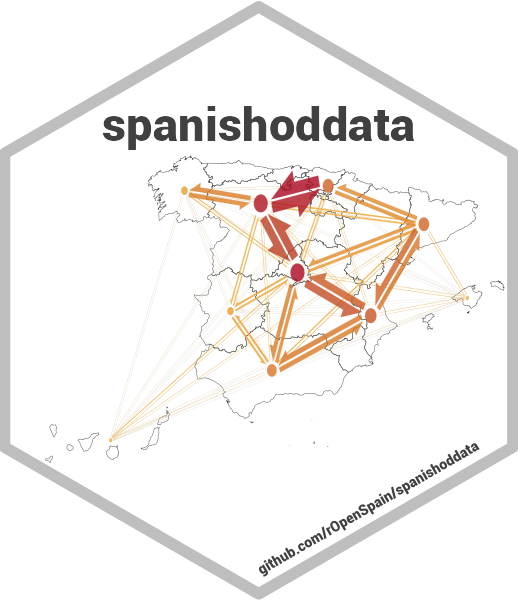
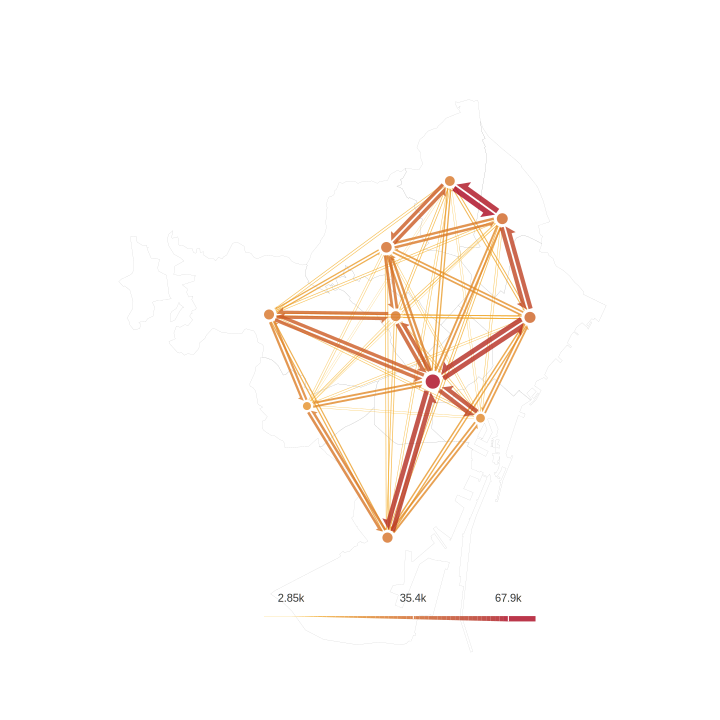
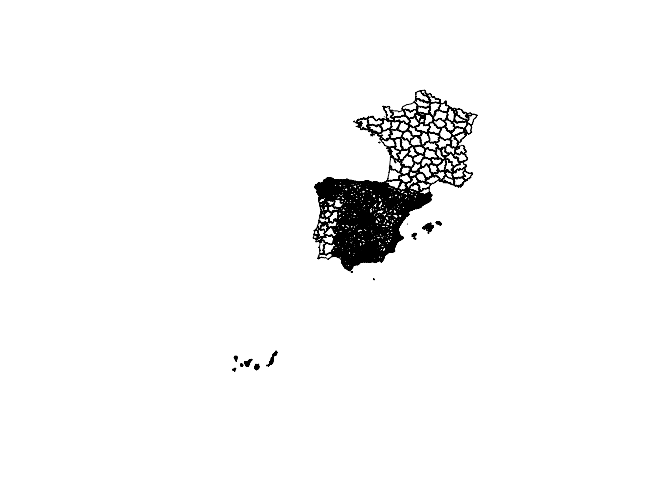
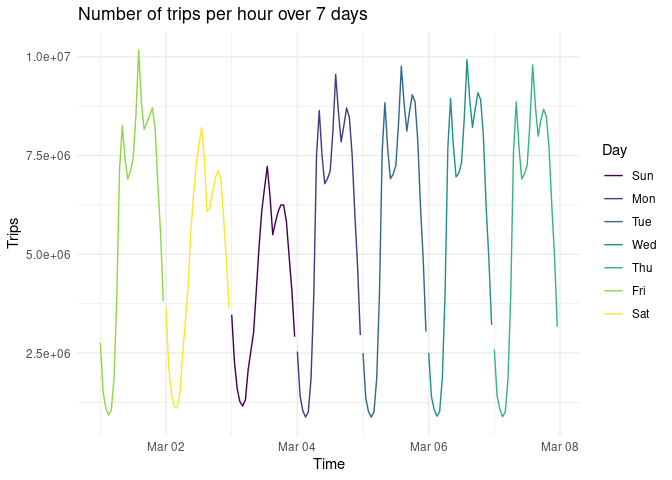
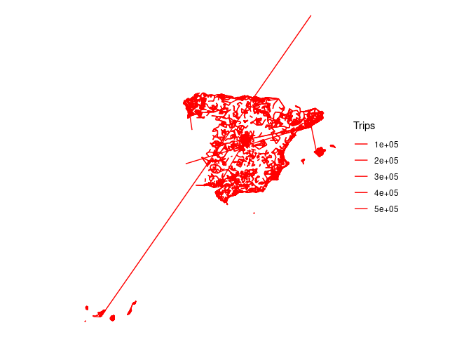
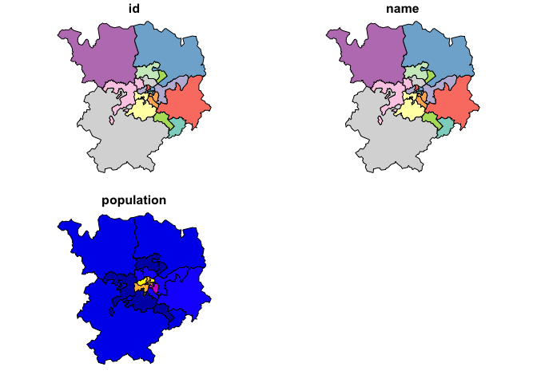
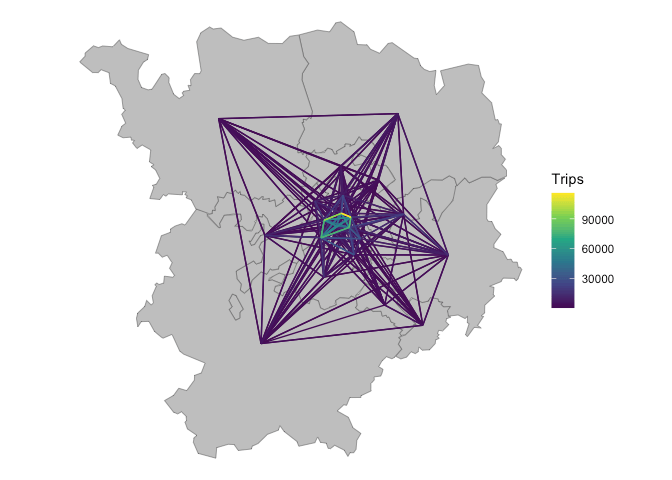

# spanishoddata: Get Spanish Origin-Destination Data <a href="https://rOpenSpain.github.io/spanishoddata/"></a>

<!-- badges: start -->

[](https://www.repostatus.org/#active)
<a href="https://lifecycle.r-lib.org/articles/stages.html#stable"
target="_blank"></a>
<a href="https://CRAN.R-project.org/package=spanishoddata"
target="_blank"></a>
<a href="https://CRAN.R-project.org/package=spanishoddata"
target="_blank"></a>
<a href="https://CRAN.R-project.org/package=spanishoddata"
target="_blank"></a>
[](https://github.com/rOpenSpain/spanishoddata/actions/workflows/R-CMD-check.yaml)
[](https://doi.org/10.32614/CRAN.package.spanishoddata)
[](https://doi.org/10.5281/zenodo.14516104)
<!-- 10.5281/zenodo.14516104 --> <!-- badges: end -->

**spanishoddata** is an R package that provides functions for
downloading and formatting Spanish open mobility data released by the
Spanish government (Ministerio de Transportes y Movilidad Sostenible
(MITMS) 2024).

It supports the two versions of the Spanish mobility data. [The first
version (2020 to
2021)](https://www.transportes.gob.es/ministerio/proyectos-singulares/estudios-de-movilidad-con-big-data/estudios-de-movilidad-anteriores/covid-19/opendata-movilidad),
covering the period of the COVID-19 pandemic, contains tables detailing
trip numbers and distances, broken down by origin, destination,
activity, residence province, time interval, distance interval, and
date. It also provides tables of individual counts by location and trip
frequency. [The second version (2022
onwards)](https://www.transportes.gob.es/ministerio/proyectos-singulares/estudios-de-movilidad-con-big-data/opendata-movilidad)
improves spatial resolution, adds trips to and from Portugal and France,
and introduces new fields for study-related activities and
sociodemographic factors (income, age, and sex) in the
origin-destination tables, along with additional tables showing
individual counts by overnight stay location, residence, and date. See
the [package website](https://rOpenSpain.github.io/spanishoddata/) and
vignettes for
[v1](https://rOpenSpain.github.io/spanishoddata/articles/v1-2020-2021-mitma-data-codebook)
and
[v2](https://rOpenSpain.github.io/spanishoddata/articles/v2-2022-onwards-mitma-data-codebook)
data for more details.

**spanishoddata** is designed to save time by providing the data in
analysis-ready formats. Automating the process of downloading, cleaning,
and importing the data can also reduce the risk of errors in the
laborious process of data preparation. It also reduces computational
resources by using computationally efficient packages behind the scenes.
To effectively work with multiple data files, it’s recommended you set
up a data directory where the package can search for the data and
download only the files that are not already present.

Under the hood, **spanishoddata** uses the efficient
[DuckDB](https://duckdb.org/) database engine via
<a href="https://r.duckdb.org/"
target="_blank"><code>{duckdb}</code></a> R package and is featured in
the <a href="https://duckdb.org/library/spanishoddata-r-package/"
target="_blank">DuckDB Library</a>.

## Examples of available data

<div id="fig-barcelona-flows">



Figure 1: Example of the data available through the package: daily flows
in Barcelona on 7 April 2021

</div>

To create static maps like that see our vignette
[here](https://ropenspain.github.io/spanishoddata/articles/flowmaps-static.html).

------------------------------------------------------------------------

<div id="fig-spain-flows">


Figure 2: Example of the data available through the package: interactive
daily flows in Spain

</div>

<div id="fig-spain-flows">


Figure 3: Example of the data available through the package: interactive
daily flows in Barcelona with time filter

</div>

To create interactive maps see our vignette
[here](https://ropenspain.github.io/spanishoddata/articles/flowmaps-interactive.html).

## Install the package

Install from CRAN:

``` r
install.packages("spanishoddata")
```

<details>

<summary>

Alternative installation and developemnt
</summary>

You can also install the latest development version of the package from
rOpenSpain R universe:

``` r
install.packages("spanishoddata",
  repos = c("https://ropenspain.r-universe.dev",
    "https://cloud.r-project.org"))
```

Alternative way to install the development version from GitHub:

``` r
if (!require("remotes")) install.packages("remotes")

remotes::install_github("rOpenSpain/spanishoddata",
  force = TRUE, dependencies = TRUE)
```

**For Developers**

To load the package locally, clone it and navigate to the root of the
package in the terminal, e.g. with the following:

``` bash
gh repo clone rOpenSpain/spanishoddata
code spanishoddata
# with rstudio:
rstudio spanishoddata/spanishoddata.Rproj
```

Then run the following command from the R console:

``` r
devtools::load_all()
```

</details>

You can also explore the package and the data in an interactive RStudio
container right in your web browser thanks to Binder, just click [the
link](https://mybinder.org/v2/gh/e-kotov/spanishoddata-playground/HEAD?urlpath=rstudio)
or the button:
[](https://mybinder.org/v2/gh/e-kotov/spanishoddata-playground/HEAD?urlpath=rstudio).
Note that the session will be limited by memory and you will only be
able to work with one full day of data.

Load it as follows:

``` r
library(spanishoddata)
```

## Set the data directory

Choose where `{spanishoddata}` should download (and convert) the data by
setting the data directory following command:

``` r
spod_set_data_dir(data_dir = "~/spanish_od_data")
```

The function above will also ensure that the directory is created and
that you have sufficient permissions to write to it.

<details>

<summary>

Setting data directory for advanced users
</summary>

You can also set the data directory with an environment variable:

``` r
Sys.setenv(SPANISH_OD_DATA_DIR = "~/spanish_od_data")
```

The package will create this directory if it does not exist on the first
run of any function that downloads the data.

To permanently set the directory for all projects, you can specify the
data directory globally by setting the `SPANISH_OD_DATA_DIR` environment
variable, e.g. with the following command:

``` r
usethis::edit_r_environ()
# Then set the data directory globally, by typing this line in the file:
```

    SPANISH_OD_DATA_DIR = "~/spanish_od_data"

You can also set the data directory locally, just for the current
project. Set the ‘envar’ in the working directory by editing `.Renviron`
file in the root of the project:

``` r
file.edit(".Renviron")
```

</details>

## Overall approach to accessing the data

If you only need flows data aggregated by day at municipal level, you
can use the `spod_quick_get_od()` function. This will download the data
directly from the web API and let you analyse it in-memory. More on this
in the [Quickly get daily
data](https://ropenspain.github.io/spanishoddata/articles/quick-get.html)
vignette.

If you only want to analyse the data for a few days, you can use the
`spod_get()` function. It will download the raw data in CSV format and
let you analyse it in-memory. This is what we cover in the steps on this
page.

If you need longer periods (several months or years), you should use the
`spod_convert()` and `spod_connect()` functions, which will convert the
data into special format which is much faster for analysis, for this see
the [Download and convert OD
datasets](https://ropenspain.github.io/spanishoddata/articles/convert.html)
vignette. `spod_get_zones()` will give you spatial data with zones that
can be matched with the origin-destination flows from the functions
above using zones ’id’s. Please see a simple example below, and also
consult the vignettes with detailed data description and instructions in
the package vignettes with `spod_codebook(ver = 1)` and
`spod_codebook(ver = 2)`, or simply visit the package website at
<https://ropenspain.github.io/spanishoddata/>. The
<a href="#fig-overall-flow" class="quarto-xref">Figure 4</a> presents
the overall approach to accessing the data in the `spanishoddata`
package.

<div id="fig-overall-flow">


Figure 4: The overview of package functions to get the data

</div>

## Showcase

To run the code in this README we will use the following setup:

``` r
library(tidyverse)
theme_set(theme_minimal())
sf::sf_use_s2(FALSE)
```

Get metadata for the datasets as follows (we are using version 2 data
covering years 2022 and onwards):

``` r
metadata <- spod_available_data(ver = 2) # for version 2 of the data
metadata
```

    # A tibble: 9,442 × 6
       target_url           pub_ts              file_extension data_ym data_ymd  
       <chr>                <dttm>              <chr>          <date>  <date>    
     1 https://movilidad-o… 2024-07-30 10:54:08 gz             NA      2022-10-23
     2 https://movilidad-o… 2024-07-30 10:51:07 gz             NA      2022-10-22
     3 https://movilidad-o… 2024-07-30 10:47:52 gz             NA      2022-10-20
     4 https://movilidad-o… 2024-07-30 10:14:55 gz             NA      2022-10-18
     5 https://movilidad-o… 2024-07-30 10:11:58 gz             NA      2022-10-17
     6 https://movilidad-o… 2024-07-30 10:09:03 gz             NA      2022-10-12
     7 https://movilidad-o… 2024-07-30 10:05:57 gz             NA      2022-10-07
     8 https://movilidad-o… 2024-07-30 10:02:12 gz             NA      2022-08-07
     9 https://movilidad-o… 2024-07-30 09:58:34 gz             NA      2022-08-06
    10 https://movilidad-o… 2024-07-30 09:54:30 gz             NA      2022-08-05
    # ℹ 9,432 more rows
    # ℹ 1 more variable: local_path <chr>

### Zones

Zones can be downloaded as follows:

``` r
distritos <- spod_get_zones("distritos", ver = 2)
distritos_wgs84 <- distritos |>
  sf::st_simplify(dTolerance = 200) |>
  sf::st_transform(4326)
plot(sf::st_geometry(distritos_wgs84), lwd = 0.2)
```



### OD data

``` r
od_db <- spod_get(
  type = "origin-destination",
  zones = "districts",
  dates = c(start = "2024-03-01", end = "2024-03-07")
)
class(od_db)
```

    [1] "tbl_duckdb_connection" "tbl_dbi"               "tbl_sql"              
    [4] "tbl_lazy"              "tbl"                  

``` r
colnames(od_db)
```

     [1] "full_date"                   "hour"                  
     [3] "id_origin"                   "id_destination"             
     [5] "distance"                    "activity_origin"            
     [7] "activity_destination"        "study_possible_origin"      
     [9] "study_possible_destination"  "residence_province_ine_code"
    [11] "residence_province"          "income"                     
    [13] "age"                         "sex"                        
    [15] "n_trips"                     "trips_total_length_km"      
    [17] "year"                        "month"                      
    [19] "day"                        

The result is an R database interface object (`tbl_dbi`) that can be
used with dplyr functions and SQL queries ‘lazily’, meaning that the
data is not loaded into memory until it is needed. Let’s do an
aggregation to find the total number trips per hour over the 7 days:

``` r
n_per_hour <- od_db |>
  group_by(date, hour) |>
  summarise(n = n(), Trips = sum(n_trips)) |>
  collect() |>
  mutate(Time = lubridate::ymd_h(paste0(date, hour, sep = " "))) |>
  mutate(Day = lubridate::wday(Time, label = TRUE))
n_per_hour |>
  ggplot(aes(x = Time, y = Trips)) +
  geom_line(aes(colour = Day)) +
  labs(title = "Number of trips per hour over 7 days")
```



The figure above summarises 925,874,012 trips over the 7 days associated
with 135,866,524 records.

### `spanishoddata` advantage over accessing the data yourself

As we demonstrated above, you can perform very quick analysis using just
a few lines of code.

To highlight the benefits of the package, here is how you would do this
manually:

- download the [xml](https://movilidad-opendata.mitma.es/RSS.xml) file
  with the download links

- parse this xml to extract the download links

- write a script to download the files and locate them on disk in a
  logical manner

- figure out the data structure of the downloaded files, read the
  codebook

- translate the data (columns and values) into English, if you are not
  familiar with Spanish

- write a script to load the data into the database or figure out a way
  to claculate summaries on multiple files

- and much more…

We did all of that for you and present you with a few simple functions
that get you straight to the data in one line of code, and you are ready
to run any analysis on it.

## Desire lines

We’ll use the same input data to pick-out the most important flows in
Spain, with a focus on longer trips for visualisation:

``` r
od_national_aggregated <- od_db |>
  group_by(id_origin, id_destination) |>
  summarise(Trips = sum(n_trips), .groups = "drop") |>
  filter(Trips > 500) |>
  collect() |>
  arrange(desc(Trips))
od_national_aggregated
```

    # A tibble: 96,404 × 3
       id_origin id_destination    Trips
       <fct>     <fct>             <dbl>
     1 2807908   2807908        2441404.
     2 0801910   0801910        2112188.
     3 0801902   0801902        2013618.
     4 2807916   2807916        1821504.
     5 2807911   2807911        1785981.
     6 04902     04902          1690606.
     7 2807913   2807913        1504484.
     8 2807910   2807910        1299586.
     9 0704004   0704004        1287122.
    10 28106     28106          1286058.
    # ℹ 96,394 more rows

The results show that the largest flows are intra-zonal. Let’s keep only
the inter-zonal flows:

``` r
od_national_interzonal <- od_national_aggregated |>
  filter(id_origin != id_destination)
```

We can convert these to geographic data with the {od} package (Lovelace
and Morgan 2024):

``` r
od_national_sf <- od::od_to_sf(
  od_national_interzonal,
  z = distritos_wgs84
)
distritos_wgs84 |>
  ggplot() +
  geom_sf(fill = "grey") +
  geom_sf(data = spData::world, fill = NA, colour = "black") +
  geom_sf(aes(linewidth = Trips), colour = "blue", data = od_national_sf) +
  coord_sf(xlim = c(-10, 5), ylim = c(35, 45)) +
  theme_void() +
  scale_linewidth_continuous(range = c(0.2, 3))
```



Let’s focus on trips in and around a particular area (Salamanca):

``` r
salamanca_zones <- zonebuilder::zb_zone("Salamanca")
distritos_salamanca <- distritos_wgs84[salamanca_zones, ]
plot(distritos_salamanca)
```



We will use this information to subset the rows, to capture all movement
within the study area:

``` r
ids_salamanca <- distritos_salamanca$id
od_salamanca <- od_national_sf |>
  filter(id_origin %in% ids_salamanca) |>
  filter(id_destination %in% ids_salamanca) |>
  arrange(Trips)
```

Let’s plot the results:

``` r
od_salamanca_sf <- od::od_to_sf(
  od_salamanca,
  z = distritos_salamanca
)
ggplot() +
  geom_sf(fill = "grey", data = distritos_salamanca) +
  geom_sf(aes(colour = Trips), size = 1, data = od_salamanca_sf) +
  scale_colour_viridis_c() +
  theme_void()
```



## Further information

For more information on the package, see:

- The [pkgdown site](https://rOpenSpain.github.io/spanishoddata/)

  - [Functions
    reference](https://rOpenSpain.github.io/spanishoddata/reference/index.html)
  - [v1 data (2020-2021)
    codebook](https://rOpenSpain.github.io/spanishoddata/articles/v1-2020-2021-mitma-data-codebook.html)
  - [v2 data (2022 onwards) codebook (work in
    progress)](https://rOpenSpain.github.io/spanishoddata/articles/v2-2022-onwards-mitma-data-codebook.html)
  - [Download and convert
    data](https://rOpenSpain.github.io/spanishoddata/articles/convert.html)
  - The [OD disaggregation
    vignette](https://rOpenSpain.github.io/spanishoddata/articles/disaggregation.html)
    showcases flows disaggregation
  - [Making static
    flowmaps](https://rOpenSpain.github.io/spanishoddata/articles/flowmaps-static.html)
    vignette shows how to create flowmaps using the data acquired with
    `{spanishoddata}`
  - [Making interactive
    flowmaps](https://rOpenSpain.github.io/spanishoddata/articles/flowmaps-interactive.html)
    shows how to create an interactive flowmap using the data acquired
    with `{spanishoddata}`
  - [Quickly getting daily aggregated 2022+ data at municipality
    level](https://ropenspain.github.io/spanishoddata/articles/quick-get.html)

- Teaching materials that use `spanishoddata`:

  - Tutorial/workshop [“Analysing massive open human mobility data using
    spanishoddata, duckdb and
    flowmaps”](https://www.ekotov.pro/agit-2025-spanishoddata/) by [Egor
    Kotov](http://github.com/e-kotov) (held at [Applied Geoinformatics
    (AGIT) Conference 2025](https://agit.at/en/program/), Salzburg,
    Austria)
    [](https://doi.org/10.5281/zenodo.15794849)

  - Tutorial [“Mobility Flows and Accessibility Using R and Big Open
    Data”](https://www.ekotov.pro/spanish-open-mobility-workshop-ic2s2-2025/)
    by [Egor Kotov](http://github.com/e-kotov) and [Johannes
    Mast](https://github.com/JohMast) (held at [IC2S2
    2025](https://www.ic2s2-2025.org/) (11th International Conference on
    Computational Social Science), Norrköping, Sweden)
    [](https://doi.org/10.5281/zenodo.16238597)

  - [Data Science for Transport
    Planning](https://tdscience.github.io/dstp/) course by [Robin
    Lovelace](https://github.com/robinlovelace), [Juan P.
    Fonseca-Zamora](https://github.com/juanfonsecaLS1), and [Yuanxuan
    Yang](https://github.com/yyuanxuan) (held at the [Institute for
    Transport Studies, University of
    Leeds](https://environment.leeds.ac.uk/transport))

### Citation

To cite the `spanishoddata` R package in publications use:

Kotov E, Vidal-Tortosa E, Cantú-Ros O, Burrieza-Galán J, Herranz R,
Gullón Muñoz-Repiso T, Lovelace R (2026). “spanishoddata: A package for
accessing and working with Spanish Open Mobility Big Data.” *Environment
and Planning B: Urban Analytics and City Science*. ISSN 2399-8083,
doi:10.1177/23998083251415040
<https://doi.org/10.1177/23998083251415040>.

To cite the official website of the mobility study use:

Ministerio de Transportes y Movilidad Sostenible (MITMS) (2024).
“Estudio de la movilidad con Big Data (Study of mobility with Big
Data).”
<https://www.transportes.gob.es/ministerio/proyectos-singulares/estudio-de-movilidad-con-big-data>.

To cite the methodology for 2022 and onwards data use:

Ministerio de Transportes y Movilidad Sostenible (MITMS) (2024).
*Estudio de movilidad de viajeros de ámbito nacional aplicando la
tecnología Big Data. Informe metodológico (Study of National Traveler
mobility Using Big Data Technology. Methodological Report)*.
<https://www.transportes.gob.es/recursos_mfom/paginabasica/recursos/a3_informe_metodologico_estudio_movilidad_mitms_v8.pdf>.

To cite the methodology for 2020-2021 data use:

Ministerio de Transportes, Movilidad y Agenda Urbana (MITMA) (2021).
*Análisis de la movilidad en España con tecnología Big Data durante el
estado de alarma para la gestión de la crisis del COVID-19 (Analysis of
mobility in Spain with Big Data technology during the state of alarm for
COVID-19 crisis management)*.
<https://cdn.mitma.gob.es/portal-web-drupal/covid-19/bigdata/mitma_-_estudio_movilidad_covid-19_informe_metodologico_v3.pdf>.

See package website for more details:
https://ropenspain.github.io/spanishoddata/

BibTeX:


    BibTeX citations:
    -----------------
    %% To cite the spanishoddata package
    @Article{spanishoddata-r-pkg,
      author = {Kotov, Egor and {Vidal-Tortosa}, Eugeni and {Cant{\'u}-Ros}, Oliva G. and {Burrieza-Gal{\'a}n}, Javier and Herranz, Ricardo and {Gull{\'o}n Mu{\~n}oz-Repiso}, Tania and Lovelace, Robin},
      title = {spanishoddata: {{A}} package for accessing and working with {{Spanish Open Mobility Big Data}}},
      issn = {2399-8083},
      doi = {10.1177/23998083251415040},
      url = {https://doi.org/10.1177/23998083251415040},
      shorttitle = {spanishoddata},
      year = {2026},
      journal = {Environment and Planning B: Urban Analytics and City Science},
    }


    %% To cite the Ministry's mobility study website
    @Misc{mitms_mobility_web,
      author = {{Ministerio de Transportes y Movilidad Sostenible (MITMS)}},
      title = {Estudio de la movilidad con Big Data (Study of mobility with Big Data)},
      url = {https://www.transportes.gob.es/ministerio/proyectos-singulares/estudio-de-movilidad-con-big-data},
      year = {2024},
    }


    %% To cite the methodology for 2020-2021 data
    @Manual{mitma_methodology_2020_v3,
      author = {{Ministerio de Transportes, Movilidad y Agenda Urbana (MITMA)}},
      title = {An{\'a}lisis de la movilidad en Espa{\~n}a con tecnolog{\'\i}a Big Data durante el estado de alarma para la gesti{\'o}n de la crisis del COVID-19 (Analysis of mobility in Spain with Big Data technology during the state of alarm for COVID-19 crisis management)},
      url = {https://cdn.mitma.gob.es/portal-web-drupal/covid-19/bigdata/mitma_-_estudio_movilidad_covid-19_informe_metodologico_v3.pdf},
      year = {2021},
    }


    %% To cite the methodology for 2022 and onwards data
    @Manual{mitms_methodology_2022_v8,
      author = {{Ministerio de Transportes y Movilidad Sostenible (MITMS)}},
      title = {Estudio de movilidad de viajeros de {\'a}mbito nacional aplicando la tecnolog{\'\i}a Big Data. Informe metodol{\'o}gico (Study of National Traveler mobility Using Big Data Technology. Methodological Report)},
      url = {https://www.transportes.gob.es/recursos_mfom/paginabasica/recursos/a3_informe_metodologico_estudio_movilidad_mitms_v8.pdf},
      year = {2024},
    }


    %% Note: A more up-to-date methodology document may be available at https://www.transportes.gob.es/ministerio/proyectos-singulares/estudios-de-movilidad-con-big-data/metodologia-del-estudio-de-movilidad-con-bigdata

### Working with Python?

Try the new work-in-progress package:
<https://github.com/pySpainMobility/pySpainMobility>.

## References

<!-- metadata for better search engine indexing -->

<!-- should be picked up by pkgdown -->

<!-- update metadata before release with  -->

<!-- cffr::cff_write() -->

<!-- codemetar::write_codemeta(write_minimeta = T) -->

<div id="refs" class="references csl-bib-body hanging-indent"
entry-spacing="0">

<div id="ref-lovelace_od_2024" class="csl-entry">

Lovelace, Robin, and Malcolm Morgan. 2024. *Od: Manipulate and Map
Origin-Destination Data*. <https://doi.org/10.32614/CRAN.package.od>.

</div>

<div id="ref-mitms_mobility_web" class="csl-entry">

Ministerio de Transportes y Movilidad Sostenible (MITMS). 2024. “Estudio
de La Movilidad Con Big Data (Study of Mobility with Big Data).”
<https://www.transportes.gob.es/ministerio/proyectos-singulares/estudio-de-movilidad-con-big-data>.

</div>

</div>
