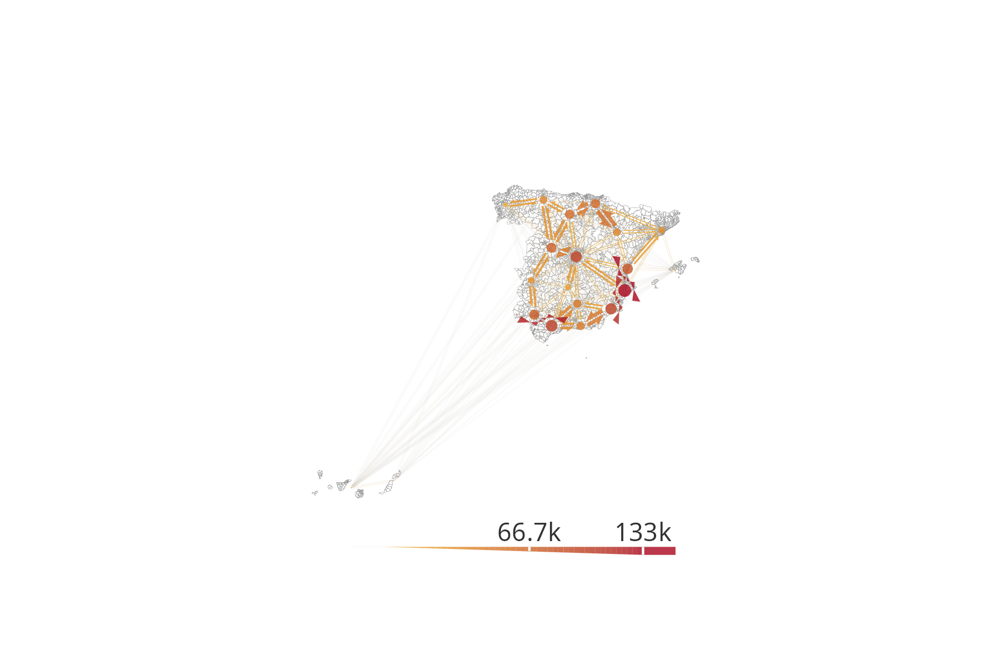
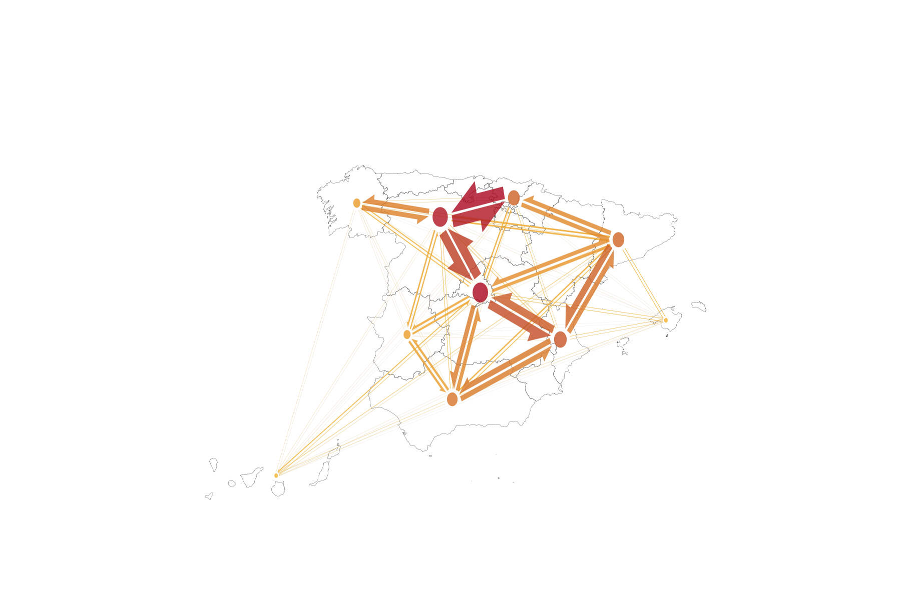

# Making static flow maps

This tutorial shows how to make static ‘flow maps’ with data from
[spanishoddata](https://rOpenSpain.github.io/spanishoddata/) and the
[flowmapper](https://github.com/JohMast/flowmapper) ([Mast
2024](#ref-flowmapper-r)) data visualisation package. We cover two
examples. [First](#simple-example), we only use the origin-destination
flows and district zones that you can get using the
[spanishoddata](https://rOpenSpain.github.io/spanishoddata/) package. In
the [second](#advanced-example) more advanced example we also use
[mapSpain](https://ropenspain.github.io/mapSpain/) and
[hexSticker](https://github.com/GuangchuangYu/hexSticker) packages to
re-create the
[spanishoddata](https://rOpenSpain.github.io/spanishoddata/) logo. For
both examples, make sure you first go though the initial [setup
steps](#setup). To make interactive flow maps, please see the
[interactive flow
maps](https://ropenspain.github.io/spanishoddata/articles/flowmaps-interactive.html)
tutorial.

## 1 Setup

``` r
library(spanishoddata)
library(flowmapper)
library(tidyverse)
library(sf)
```

## 2 Set the data directory

Choose where
[spanishoddata](https://rOpenSpain.github.io/spanishoddata/) should
download (and convert) the data by setting the data directory following
command:

``` r
spod_set_data_dir(data_dir = "~/spanish_od_data")
```

The function above will also ensure that the directory is created and
that you have sufficient permissions to write to it.

Setting data directory for advanced users

You can also set the data directory with an environment variable:

``` r
Sys.setenv(SPANISH_OD_DATA_DIR = "~/spanish_od_data")
```

The package will create this directory if it does not exist on the first
run of any function that downloads the data.

To permanently set the directory for all projects, you can specify the
data directory globally by setting the `SPANISH_OD_DATA_DIR` environment
variable, e.g. with the following command:

``` r
usethis::edit_r_environ()
# Then set the data directory globally, by typing this line in the file:
```

    SPANISH_OD_DATA_DIR = "~/spanish_od_data"

You can also set the data directory locally, just for the current
project. Set the ‘envar’ in the working directory by editing `.Renviron`
file in the root of the project:

``` r
file.edit(".Renviron")
```

## 3 Simple example - plot flows data as it is

### 3.1 Get data

#### 3.1.1 Flows

Let us get the flows between `districts` for a typical working day
`2021-04-07`:

``` r
od_20210407 <- spod_get("od", zones = "distr", dates = "2021-04-07")

head(od_20210407)
```

    # Source:   SQL [6 x 14]
    # Database: DuckDB v1.0.0 [root@Darwin 23.6.0:R 4.4.1/:memory:]
      date       id_origin id_destination activity_origin activity_destination residence_province_in…¹ residence_province_n…² hour distance n_trips trips_total_length_km  year month
      <date>     <fct>     <fct>          <fct>           <fct>                <fct>                   <fct>                      <int> <fct>      <dbl>                 <dbl> <int> <int>
    1 2021-04-07 01001_AM  01001_AM       home            other                01                      Araba/Álava                    0 005-010     10.5                  68.9  2021     4
    2 2021-04-07 01001_AM  01001_AM       home            other                01                      Araba/Álava                    0 010-050     12.6                 127.   2021     4
    3 2021-04-07 01001_AM  01001_AM       home            other                01                      Araba/Álava                    1 010-050     12.6                 232.   2021     4
    4 2021-04-07 01001_AM  01001_AM       home            other                01                      Araba/Álava                    2 005-010     10.8                 102.   2021     4
    5 2021-04-07 01001_AM  01001_AM       home            other                01                      Araba/Álava                    5 005-010     18.9                 156.   2021     4
    6 2021-04-07 01001_AM  01001_AM       home            other                01                      Araba/Álava                    6 010-050     10.8                 119.   2021     4
    # ℹ abbreviated names: ¹​residence_province_ine_code, ²​residence_province_name
    # ℹ 1 more variable: day <int>

#### 3.1.2 Zones

We also get the district zones polygons to match the flows. We use
version 1 for the polygons, because the selected date is in 2021, which
corresponds to the v1 data (see the relevant
[codebook](https://rOpenSpain.github.io/spanishoddata/articles/v1-2020-2021-mitma-data-codebook.md)).

``` r
districts_v1 <- spod_get_zones("dist", ver = 1)

head(districts_v1)
```

    Simple feature collection with 6 features and 6 fields
    Geometry type: MULTIPOLYGON
    Dimension:     XY
    Bounding box:  xmin: 289502.8 ymin: 4173922 xmax: 1010926 ymax: 4720817
    Projected CRS: ETRS89 / UTM zone 30N (N-E)
    # A tibble: 6 × 7
      id       census_districts                                              municipalities_mitma municipalities         district_names_in_v2 district_ids_in_v2                      geom
      <chr>    <chr>                                                         <chr>                <chr>                  <chr>                <chr>                     <MULTIPOLYGON [m]>
    1 2408910  2408910                                                       24089                24089                  León distrito 10     2408910            (((290940.1 4719080, 290…
    2 22117_AM 2210201; 2210301; 2211501; 2211701; 2216401; 2218701; 2221401 22117_AM             22102; 22103; 22115; … Graus agregacion de… 22117_AM           (((774184.4 4662153, 774…
    3 2305009  2305009                                                       23050                23050                  Jaén distrito 09     2305009            (((429745 4179977, 42971…
    4 07058_AM 0701901; 0702501; 0703401; 0705801; 0705802                   07058_AM             07019; 07025; 07034; … Selva agregacion de… 07058_AM           (((1000859 4415059, 1000…
    5 2305006  2305006                                                       23050                23050                  Jaén distrito 06     2305006            (((429795.1 4180957, 429…
    6 2305005  2305005                                                       23050                23050                  Jaén distrito 05     2305005            (((430022.7 4181101, 429…

### 3.2 Aggregate data - count total flows

``` r
od_20210407_total <- od_20210407 |>
  group_by(o = id_origin, d = id_destination) |>
  summarise(value = sum(n_trips, na.rm = TRUE), .groups = "drop") |>
  collect() |>
  arrange(o, d, value)
```

### 3.3 Reshape flows for visualization

The [flowmapper](https://github.com/JohMast/flowmapper) package was
developed to visualise origin-destination ‘flow’ data ([Mast
2024](#ref-flowmapper-r)). This package expects the data to be in the
following format:

A `data.frame` with origin-destination pairs and the flow counts between
them with the following columns:

- `o`: The unique id of the origin node

- `d`: The unique id of the destination node

- `value`: The intensity of flow between the origin and destination

Another `data.frame` with the node `id`s or names and their coordinates.
The coordinate reference system should match whichever other data you
are planning to use in the plot.

`name`: The unique `id` or `name` of the node, must match with `o` and
`d` in the flows `data.frame` above;

`x`: The x coordinate of the node;

`y`: The y coordinate of the node;

#### 3.3.1 Prepare the flows table

The previous code chunk created `od_20210407_total` with the column
names expected by [flowmapper](https://github.com/JohMast/flowmapper).

``` r
head(od_20210407_total)
```

    # A tibble: 6 × 3
      o       d          value
      <fct>   <fct>      <dbl>
    1 2408910 2408910  1889.
    2 2408910 24154_AM   11.0
    3 2408910 5029703    12.8
    4 2408910 24181_AM   22.3
    5 2408910 4802004     9.45
    6 2408910 4718608     4.75 

#### 3.3.2 Prepare the nodes table with coordinates

We need the coordinates for each origin and destination. We can use the
centroids of `districts_v1` polygons for that.

``` r
districts_v1_coords <- districts_v1 |>
  st_centroid() |>
  st_coordinates() |>
  as.data.frame() |>
  mutate(name = districts_v1$id) |>
  rename(x = X, y = Y)

head(districts_v1_coords)
```

              x       y     name
    1  290380.7 4719394  2408910
    2  774727.2 4674304 22117_AM
    3  428315.4 4177662  2305009
    4 1001283.0 4422732 07058_AM
    5  427524.2 4180942  2305006
    6  428302.1 4190937  2305005

### 3.4 Plot the flows

#### 3.4.1 Plot the entire country

Now we have the data structure that match the
[flowmapper](https://github.com/JohMast/flowmapper)‘s expected data
format we can plot a sample of the data (a plot containing all flows
would be very ’busy’ and world resemble a haystack!). The `k_node`
argument in the `add_flowmap` function can be used to reduce this
business.

``` r
# create base ggplot with boundaries removing various visual clutter
base_plot_districts <- ggplot() +
  geom_sf(data = districts_v1, fill = NA, col = "grey60", linewidth = 0.05) +
  theme_classic(base_size = 20) +
  labs(title = "", subtitle = "", fill = "", caption = "") +
  theme(
    axis.line = element_blank(),
    axis.text = element_blank(),
    axis.ticks = element_blank(),
    axis.title = element_blank(),
    panel.background = element_rect(fill = "transparent"),
    plot.background = element_rect(fill = "transparent", color = NA),
    panel.grid.major = element_blank(),
    panel.grid.minor = element_blank()
  ) +
  guides(fill = "none")

# flows_by_ca_twoway_coords |> arrange(desc(flow_ab))
# add the flows
flows_plot_all_districts <- base_plot_districts |>
  add_flowmap(
    od = od_20210407_total,
    nodes = districts_v1_coords,
    node_radius_factor = 1,
    edge_width_factor = 1,
    arrow_point_angle = 35,
    node_buffer_factor = 1.5,
    outline_col = "grey80",
    add_legend = "bottom",
    legend_col = "gray20",
    legend_gradient = TRUE,
    k_node = 20 # play around with this parameter to aggregate nodes and flows
  )

# customise colours for the fill
flows_plot_all_districts <- flows_plot_all_districts +
  scale_fill_gradient(
    low = "#FABB29",
    high = "#AB061F",
    labels = scales::comma_format() # Real value labels
  )


flows_plot_all_districts
```



#### 3.4.2 Zoom in to the city level

Let us filter the flows and zones data to just a specific functional
urban area to take a closer look at the flows.

##### 3.4.2.1 Filter the zones

Using the `district_names_in_v2` column in the zones data, we can easily
identify the districts within Barcelona.

``` r
zones_barcelona <- districts_v1 |>
  filter(grepl("Barcelona", district_names_in_v2, ignore.case = TRUE))

zones_barcelona_plot <- ggplot() +
  geom_sf(data = zones_barcelona, fill = NA, col = "grey60", linewidth = 0.3) +
  theme_minimal()

zones_barcelona_plot
```


We also prepare the nodes for the `add_flowmap` function:

``` r
zones_barcelona_coords <- zones_barcelona |>
  st_centroid() |>
  st_coordinates() |>
  as.data.frame() |>
  mutate(name = zones_barcelona$id) |>
  rename(x = X, y = Y)

head(zones_barcelona_coords)
```

             x       y    name
    1 926837.9 4597166 0801905
    2 927995.1 4594372 0801904
    3 930418.9 4599218 0801907
    4 930702.3 4597116 0801906
    5 933291.0 4594003 0801901
    6 930452.8 4590357 0801903

##### 3.4.2.2 Prepare the flows

Now we can use the zone `id`s from the `zones_barcelona` data to select
the flows that correspond to Barcelona.

``` r
od_20210407_total_barcelona <- od_20210407_total |>
  filter(o %in% zones_barcelona$id & d %in% zones_barcelona$id)
```

##### 3.4.2.3 Visualise the flows for Barcelona

Now, we can create a new plot with this data. Once again, we need the
`k_node` argument to tweak the aggregation of nodes and flows. Feel free
to tweak it yourself and see how the results change.

``` r
# create base ggplot with boundaries removing various visual clutter
base_plot_barcelona <- ggplot() +
  geom_sf(data = zones_barcelona, fill = NA, col = "grey60", linewidth = 0.3) +
  theme_classic(base_size = 20) +
  labs(title = "", subtitle = "", fill = "", caption = "") +
  theme(
    axis.line = element_blank(),
    axis.text = element_blank(),
    axis.ticks = element_blank(),
    axis.title = element_blank(),
    panel.background = element_rect(fill = "transparent"),
    plot.background = element_rect(fill = "transparent", color = NA),
    panel.grid.major = element_blank(),
    panel.grid.minor = element_blank()
  ) +
  guides(fill = "none")

# flows_by_ca_twoway_coords |> arrange(desc(flow_ab))
# add the flows
flows_plot_barcelona <- base_plot_barcelona |>
  add_flowmap(
    od = od_20210407_total_barcelona,
    nodes = zones_barcelona_coords,
    node_radius_factor = 1,
    edge_width_factor = 0.6,
    arrow_point_angle = 45,
    node_buffer_factor = 1.5,
    outline_col = "grey80",
    add_legend = "bottom",
    legend_col = "gray20",
    legend_gradient = TRUE,
    k_node = 10 # play around with this parameter to aggregate nodes and flows
  )

# customise colours for the fill
flows_plot_barcelona <- flows_plot_barcelona +
  scale_fill_gradient(
    low = "#FABB29",
    high = "#AB061F",
    labels = scales::comma_format() # Real value labels
  )

flows_plot_barcelona
```


## 4 Advanced example - aggregate flows for `{spanishoddata}` logo

For the advanced example we will need two additional packages:
[mapSpain](https://ropenspain.github.io/mapSpain/) ([Hernangómez
2024](#ref-R-mapspain)) and
[hexSticker](https://github.com/GuangchuangYu/hexSticker)
([**R-hexSticker?**](#ref-R-hexSticker)).

``` r
# two new packages
library(mapSpain)
library(hexSticker)

# load these too, if you have not already
library(spanishoddata)
library(flowmapper)
library(tidyverse)
library(sf)
```

### 4.1 Get data

#### 4.1.1 Flows

Just like in the simple example above, we will need the flows to
visualise.

Let us get the origin-destination flows between `districts` for a
typical working day `2022-04-06`:

``` r
od <- spod_get("od", zones = "distr", dates = "2022-04-06")
```

Also get the spatial data for the zones. We are using the version 2 of
zones, because the data we got was for 2022 and onwards, which
corresponds to the v2 data (see the relevant
[codebook](https://rOpenSpain.github.io/spanishoddata/articles/v2-2022-onwards-mitma-data-codebook.md)).

``` r
districts <- spod_get_zones("distr", ver = 2)
```

#### 4.1.2 Map of Spain

Ultimately, we would like to plot the flows on a map of Spain, so we
will aggregate the flows for visualisation to avoid visual clutter. We
therefore also need a nice map of Spain, which we will get using
[mapSpain](https://ropenspain.github.io/mapSpain/) ([Hernangómez
2024](#ref-R-mapspain)) package:

``` r
spain_for_vis <- esp_get_ccaa()
spain_for_join <- esp_get_ccaa(moveCAN = FALSE)
```

We are getting two sets of boundaries. First one is with Canary Islands
moved closer to the mainland Spain, for nicer visualisation. Second one
is with the original location of the islands, so that we can spatially
join them to the zones `districts` data we got from
[spanishoddata](https://rOpenSpain.github.io/spanishoddata/).

### 4.2 Flows aggregation

#### 4.2.1 Aggregate raw origin destination data by original `id`s

Let us count the total number of trips made between all locations on our
selected day of `2022-04-06`:

``` r
flows_by_district <- od |>
  group_by(id_origin, id_destination) |>
  summarise(n_trips = sum(n_trips, na.rm = TRUE), .groups = "drop") |>
  collect() |>
  arrange(desc(id_origin), id_destination, n_trips)

flows_by_district
```

    # A tibble: 402,711 × 3
       id_origin id_destination n_trips
       <fct>     <fct>            <dbl>
     1 31260_AM  01017_AM          7.15
     2 31260_AM  01043            13.7
     3 31260_AM  0105902          16.1
     4 31260_AM  2512005          12.2
     5 31260_AM  26002_AM          8
     6 31260_AM  26026_AM          4
     7 31260_AM  26036            38.3
     8 31260_AM  26061_AM         10.6
     9 31260_AM  26084             5.5
    10 31260_AM  2608902         109.
    # ℹ 402,701 more rows
    # ℹ Use `print(n = ...)` to see more rows

#### 4.2.2 Match `id`s of `districts` with autonomous communities

Now we need to do a spatial join between `districts` and
`spain_for_join` to find out which districts fall within which
autonomous community. We use `spain_for_join`. If we used
`spain_for_vis`, the `districts` in the Canary Islands would not match
with the boundaries of the islands.

``` r
district_centroids <- districts |>
  st_centroid() |>
  st_transform(crs = st_crs(spain_for_join))

ca_distr <- district_centroids |>
  st_join(spain_for_join) |>
  st_drop_geometry() |>
  filter(!is.na(ccaa.shortname.en)) |>
  select(id, ca_name = ccaa.shortname.en)

ca_distr
```

    # A tibble: 3,784 × 2
       id       ca_name
       <chr>    <chr>
     1 01001    Basque Country
     2 01002    Basque Country
     3 01004_AM Basque Country
     4 01009_AM Basque Country
     5 01010    Basque Country
     6 01017_AM Basque Country
     7 01028_AM Basque Country
     8 01036    Basque Country
     9 01043    Basque Country
    10 01047_AM Basque Country
    # ℹ 3,774 more rows
    # ℹ Use `print(n = ...)` to see more rows

This way we get a table with `districts` `id`s and their corresponding
autonomous community names.

#### 4.2.3 Count flows between pairs of autonomous communities

We can now add these ids to the total flows by `districts` `id` pairs
and calculate total flows between autonomous communities:

``` r
flows_by_ca <- flows_by_district |>
  left_join(
    ca_distr |>
      rename(id_orig = ca_name),
    by = c("id_origin" = "id")
  ) |>
  left_join(
    ca_distr |>
      rename(id_dest = ca_name),
    by = c("id_destination" = "id")
  ) |>
  group_by(id_orig, id_dest) |>
  summarise(n_trips = sum(n_trips, na.rm = TRUE), .groups = "drop") |>
  rename(o = id_orig, d = id_dest, value = n_trips)

flows_by_ca
```

    # A tibble: 358 × 3
       o         d                     value
       <chr>     <chr>                 <dbl>
     1 Andalusia Andalusia         23681858.
     2 Andalusia Aragon                 643.
     3 Andalusia Asturias               373.
     4 Andalusia Balearic Islands       931.
     5 Andalusia Basque Country         769.
     6 Andalusia Canary Islands        1899.
     7 Andalusia Cantabria              153.
     8 Andalusia Castile and León      3114.
     9 Andalusia Castile-La Mancha    13655.
    10 Andalusia Catalonia             5453.
    # ℹ 348 more rows
    # ℹ Use `print(n = ...)` to see more rows

### 4.3 Reshape flows for visualization

We are going to use the
[flowmapper](https://github.com/JohMast/flowmapper) ([Mast
2024](#ref-flowmapper-r)) package to plot the flows. This package
expects the data to be in the following format:

A `data.frame` with origin-destination pairs and the flow counts between
them with the following columns:

- `o`: The unique id of the origin node

- `d`: The unique id of the destination node

- `value`: The intensity of flow between the origin and destination

Another `data.frame` with the node `id`s or names and their coordinates.
The coordinate reference system should match whichever other data you
are planning to use in the plot.

`name`: The unique `id` or `name` of the node, must match with `o` and
`d` in the flows `data.frame` above;

`x`: The x coordinate of the node;

`y`: The y coordinate of the node;

#### 4.3.1 Prepare the flows table

The data we have right now in `flows_by_ca` already has the correct
format expected by [flowmapper](https://github.com/JohMast/flowmapper).

``` r
head(flows_by_ca)
```

    # A tibble: 6 × 3
      o         d                    value
      <chr>     <chr>                <dbl>
    1 Andalusia Andalusia        23681858.
    2 Andalusia Aragon                643.
    3 Andalusia Asturias              373.
    4 Andalusia Balearic Islands      931.
    5 Andalusia Basque Country        769.
    6 Andalusia Canary Islands       1899.

#### 4.3.2 Prepare the nodes table with coordinates

We need the coordinates for each origin and destination. We can use the
centroids of `districts_v1` polygons for that.

``` r
spain_for_vis_coords <- spain_for_vis |>
  st_centroid() |>
  st_coordinates() |>
  as.data.frame() |>
  mutate(name = spain_for_vis$ccaa.shortname.en) |>
  rename(x = X, y = Y)

head(spain_for_vis_coords)
```

          x        y             name
    1  -4.5777846 37.46782        Andalusia
    2  -0.6648791 41.51335           Aragon
    3  -5.9936312 43.29377         Asturias
    4   2.9065933 39.57481 Balearic Islands
    5 -10.7324736 35.36091   Canary Islands
    6  -4.0300438 43.19772        Cantabria

### 4.4 Plot the flows

Now we have the data structure that match the
[flowmapper](https://github.com/JohMast/flowmapper)’s expected data
format:

``` r
# create base ggplot with boundaries removing any extra elements
base_plot <- ggplot() +
  geom_sf(data = spain_for_vis, fill = NA, col = "grey30", linewidth = 0.05) +
  theme_classic(base_size = 20) +
  labs(title = "", subtitle = "", fill = "", caption = "") +
  theme(
    axis.line = element_blank(),
    axis.text = element_blank(),
    axis.ticks = element_blank(),
    axis.title = element_blank(),
    panel.background = element_rect(fill = "transparent"),
    plot.background = element_rect(fill = "transparent", color = NA),
    panel.grid.major = element_blank(),
    panel.grid.minor = element_blank()
  ) +
  guides(fill = "none")

# flows_by_ca_twoway_coords |> arrange(desc(flow_ab))
# add the flows
flows_plot <- base_plot |>
  add_flowmap(
    od = flows_by_ca,
    nodes = spain_for_vis_coords,
    node_radius_factor = 1,
    edge_width_factor = 1,
    arrow_point_angle = 35,
    node_buffer_factor = 1.5,
    outline_col = "grey80",
    k_node = 10 # play around with this parameter to aggregate nodes and flows
  )

# customise colours and remove legend, as we need a clean image for the logo
flows_plot <- flows_plot +
  guides(fill = "none") +
  scale_fill_gradient(low = "#FABB29", high = "#AB061F")


flows_plot
```



The image may look a bit bleak, but when we put it on a sticker, it will
look great.

### 4.5 Make the sticker

We make the sticker using the
[hexSticker](https://github.com/GuangchuangYu/hexSticker) ([Yu
2020](#ref-hexSticker-r)) package.

``` r
sticker(
  flows_plot,

  # package name
  package = "spanishoddata",
  p_size = 4,
  p_y = 1.6,
  p_color = "gray25",
  p_family = "Roboto",

  # ggplot image size and position
  s_x = 1.02,
  s_y = 1.19,
  s_width = 2.6,
  s_height = 2.72,

  # white hex
  h_fill = "#ffffff",
  h_color = "grey",
  h_size = 1.3,

  # url
  url = "github.com/rOpenSpain/spanishoddata",
  u_color = "gray25",
  u_family = "Roboto",
  u_size = 1.2,

  # save output name and resolution
  filename = "./man/figures/logo.png",
  dpi = 300 #
)
```


Hernangómez, Diego. 2024. *mapSpain: Administrative Boundaries of Spain*
(version 0.9.2). <https://doi.org/10.5281/zenodo.5366622>.

Mast, Johannes. 2024. *Flowmapper: Draw Flows (Migration, Goods, Money,
Information) on ’Ggplot2’ Plots*.
<https://doi.org/10.32614/CRAN.package.flowmapper>.

Yu, Guangchuang. 2020. *hexSticker: Create Hexagon Sticker in r*.
<https://doi.org/10.32614/CRAN.package.hexSticker>.
