# Codebook and cookbook for v1 (2020-2021) Spanish mobility data

You can view this vignette any time by running:

``` r
spanishoddata::spod_codebook(ver = 1)
```

The mobility data v1 (2020-2021) was originally released by the
Ministerio de Transportes, Movilidad y Agenda Urbana (MITMA) , now
[Ministerio de Transportes y Movilidad Sostenible
(MITMS)](https://www.transportes.gob.es/) ([Ministerio de Transportes,
Movilidad y Agenda Urbana (MITMA)
2021](#ref-mitma_methodology_2020_v3)).

The dataset is produced by [Nommon](https://www.nommon.es/) using the
raw data from [Orange España](https://www.orange.es/). Even though the
raw data is only from one mobile phone operator, the resulting flows and
other counts of number of individuals in the data set are already
resampled to be representative of the total population of Spain (see
details in the official methodology).

The tables in the data set provide hourly flows between zones across
Spain for every day of the observation period (2020-02-14 to
2021-05-09), and the number of individuals making trips for each zone.
This document will introduce you to the available data and provide brief
code snippets on how to access it using the
[spanishoddata](https://rOpenSpain.github.io/spanishoddata/) R package.

Key sources for this codebook/cookbook include:

- [original data collection methodology in
  Spanish](https://cdn.mitma.gob.es/portal-web-drupal/covid-19/bigdata/mitma_-_estudio_movilidad_covid-19_informe_metodologico_v3.pdf) +
  [automatically translated English version of
  methodology](https://rOpenSpain.github.io/spanishoddata/codebooks/mitma_-_estudio_movilidad_covid-19_informe_metodologico_v3_en.pdf)

- [original data codebook in
  Spanish](https://opendata-movilidad.mitma.es/README%20-%20formato%20ficheros%20movilidad%20MITMA%2020201228.pdf) +
  [automatically translated English version of
  codebook](https://rOpenSpain.github.io/spanishoddata/codebooks/README_-_formato_ficheros_movilidad_MITMA_20201228_en.pdf)

- [original data download
  page](https://www.transportes.gob.es/ministerio/proyectos-singulares/estudios-de-movilidad-con-big-data/estudios-de-movilidad-anteriores/covid-19/opendata-movilidad)

- [original data
  license](https://opendata-movilidad.mitma.es/LICENCIA%20de%20datos%20abiertos%20del%20MITMA%2020201203.pdf)

- [homepage of the v1
  study](https://www.transportes.gob.es/ministerio/proyectos-singulares/estudios-de-movilidad-con-big-data/estudios-de-movilidad-anteriores/covid-19)

- [homepage of the open mobility data project of the Ministry of
  Transport and Sustainable Mobility of
  Spain](https://www.transportes.gob.es/ministerio/proyectos-singulares/estudio-de-movilidad-con-big-data)

**Note: Kindly consult the documents above for any specific details on
the methodology. The codebook here is only a simplified summary.**

To access the data we reference in this codebook, please follow these
steps:

## Install the package

Install from CRAN:

``` r
install.packages("spanishoddata")
```

Alternative installation and developemnt

You can also install the latest development version of the package from
rOpenSpain R universe:

``` r
install.packages("spanishoddata",
  repos = c("https://ropenspain.r-universe.dev",
    "https://cloud.r-project.org"))
```

Alternative way to install the development version from GitHub:

``` r
if (!require("remotes")) install.packages("remotes")

remotes::install_github("rOpenSpain/spanishoddata",
  force = TRUE, dependencies = TRUE)
```

**For Developers**

To load the package locally, clone it and navigate to the root of the
package in the terminal, e.g. with the following:

``` bash
gh repo clone rOpenSpain/spanishoddata
code spanishoddata
# with rstudio:
rstudio spanishoddata/spanishoddata.Rproj
```

Then run the following command from the R console:

``` r
devtools::load_all()
```

You can also explore the package and the data in an interactive RStudio
container right in your web browser thanks to Binder, just click [the
link](https://mybinder.org/v2/gh/e-kotov/spanishoddata-playground/HEAD?urlpath=rstudio)
or the button:
[](https://mybinder.org/v2/gh/e-kotov/spanishoddata-playground/HEAD?urlpath=rstudio).
Note that the session will be limited by memory and you will only be
able to work with one full day of data.

Load it as follows:

``` r
library(spanishoddata)
```

Using the instructions below, set the data folder for the package to
download the files into. You may need up to 30 GB to download all data
and another 30 GB if you would like to convert the downloaded data into
analysis ready format (a `DuckDB` database file, or a folder of
`parquet` files). You can find more info on this conversion in the
[Download and convert OD
datasets](https://rOpenSpain.github.io/spanishoddata/articles/convert.md)
vignette.

## Set the data directory

Choose where
[spanishoddata](https://rOpenSpain.github.io/spanishoddata/) should
download (and convert) the data by setting the data directory following
command:

``` r
spod_set_data_dir(data_dir = "~/spanish_od_data")
```

The function above will also ensure that the directory is created and
that you have sufficient permissions to write to it.

Setting data directory for advanced users

You can also set the data directory with an environment variable:

``` r
Sys.setenv(SPANISH_OD_DATA_DIR = "~/spanish_od_data")
```

The package will create this directory if it does not exist on the first
run of any function that downloads the data.

To permanently set the directory for all projects, you can specify the
data directory globally by setting the `SPANISH_OD_DATA_DIR` environment
variable, e.g. with the following command:

``` r
usethis::edit_r_environ()
# Then set the data directory globally, by typing this line in the file:
```

    SPANISH_OD_DATA_DIR = "~/spanish_od_data"

You can also set the data directory locally, just for the current
project. Set the ‘envar’ in the working directory by editing `.Renviron`
file in the root of the project:

``` r
file.edit(".Renviron")
```

## Overall approach to accessing the data

If you only need flows data aggregated by day at municipal level, you
can use the
[`spod_quick_get_od()`](https://rOpenSpain.github.io/spanishoddata/reference/spod_quick_get_od.md)
function. This will download the data directly from the web API and let
you analyse it in-memory. More on this in the [Quickly get daily
data](https://ropenspain.github.io/spanishoddata/articles/quick-get.html)
vignette.

If you only want to analyse the data for a few days, you can use the
[`spod_get()`](https://rOpenSpain.github.io/spanishoddata/reference/spod_get.md)
function. It will download the raw data in CSV format and let you
analyse it in-memory. This is what we cover in the steps on this page.

If you need longer periods (several months or years), you should use the
[`spod_convert()`](https://rOpenSpain.github.io/spanishoddata/reference/spod_convert.md)
and
[`spod_connect()`](https://rOpenSpain.github.io/spanishoddata/reference/spod_connect.md)
functions, which will convert the data into special format which is much
faster for analysis, for this see the [Download and convert OD
datasets](https://ropenspain.github.io/spanishoddata/articles/convert.html)
vignette.
[`spod_get_zones()`](https://rOpenSpain.github.io/spanishoddata/reference/spod_get_zones.md)
will give you spatial data with zones that can be matched with the
origin-destination flows from the functions above using zones ’id’s.
Please see a simple example below, and also consult the vignettes with
detailed data description and instructions in the package vignettes with
`spod_codebook(ver = 1)` and `spod_codebook(ver = 2)`, or simply visit
the package website at <https://ropenspain.github.io/spanishoddata/>.
The [Figure 1](#fig-overall-flow) presents the overall approach to
accessing the data in the `spanishoddata` package.



Figure 1: The overview of package functions to get the data

## 1. Spatial data with zoning boundaries

The boundary data is provided at two geographic levels:
[`Districts`](#districts) and [`Municipalities`](#municipalities). It’s
important to note that these do not always align with the official
Spanish census districts and municipalities. To comply with data
protection regulations, certain aggregations had to be made to districts
and municipalities”.

### 1.1 `Districts`

`Districts` correspond to official census districts in cities; however,
in those with lower population density, they are grouped together. In
rural areas, one district is often equal to a municipality, but
municipalities with low population are combined into larger units to
preserve privacy of individuals in the dataset. Therefore, there are
2850 ‘districts’ compared to the 10494 official census districts on
which they are based.

To access it:

``` r
districts_v1 <- spod_get_zones("dist", ver = 1)
```

The `districts_v1` object is of class `sf` consisting of polygons.

Data structure:

| Variable Name          | **Description**                                                                                                                                                                                                                                                                                    |
|------------------------|----------------------------------------------------------------------------------------------------------------------------------------------------------------------------------------------------------------------------------------------------------------------------------------------------|
| `id`                   | District `id` assigned by the data provider. Matches with `id_origin`, `id_destination`, and `id` in district level [origin-destination data](#od-data) and [number of trips data](#ptc-data).                                                                                                     |
| `census_districts`     | A string with semicolon-separated list of census district semicolon-separated identifiers as classified by the Spanish Statistical Office (INE) that are spatially bound within polygons with `id` above.                                                                                          |
| `municipalities_mitma` | A string with semicolon-separated list of municipality identifiers as assigned by the data provider in municipality zones spatial dataset that correspond to a given district `id` .                                                                                                               |
| `municipalities`       | A string with semicolon-separated list of municipality identifiers as classified by the Spanish Statistical Office (INE) that correspond to polygons with `id` above.                                                                                                                              |
| `district_names_in_v2` | A string with semicolon-separated list of names of district polygons defined in the [v2 version of this data](https://rOpenSpain.github.io/spanishoddata/articles/v2-2022-onwards-mitma-data-codebook.md) that covers the year 2022 and onwards that correspond to polygons with `id` above.       |
| `district_ids_in_v2`   | A string with semicolon-separated list of identifiers of district polygons defined in the [v2 version of this data](https://rOpenSpain.github.io/spanishoddata/articles/v2-2022-onwards-mitma-data-codebook.md) that covers the year 2022 and onwards that correspond to polygons with `id` above. |

### 1.2 `Municipalities`

`Municipalities` are made up of official municipalities in those of a
certain size; however, they have also been aggregated in cases of lower
population density. As a result, there are 2,205 municipalities compared
to the 8,125 official municipalities on which they are based.

To access it:

``` r
municipalities_v1 <- spod_get_zones("muni", ver = 1)
```

The resulting `municipalities_v1` object is type `sf` consisting of
polygons.

Data structure:

| Variable Name              | **Description**                                                                                                                                                                                                                                                        |
|----------------------------|------------------------------------------------------------------------------------------------------------------------------------------------------------------------------------------------------------------------------------------------------------------------|
| `id`                       | District `id` assigned by the data provider. Matches with `id_origin`, `id_destination`, and `id` in municipality level [origin-destination data](#od-data) and [population by trip count](#pop-tc).                                                                   |
| `municipalities`           | A list of municipality identifiers as classified by the Spanish Statistical Office (INE) that correspond to polygons with `id` above.                                                                                                                                  |
| `districts_mitma`          | A list of district identifiers as assigned by the data provider in districts zones spatial dataset that correspond to a given municipality `id` .                                                                                                                      |
| `census_districts`         | A list of census district identifiers as classified by the Spanish Statistical Office (INE) that are spatially bound within polygons with `id` above.                                                                                                                  |
| `municipality_names_in_v2` | A list of names of municipality polygons defined in the [v2 version of this data](https://rOpenSpain.github.io/spanishoddata/articles/v2-2022-onwards-mitma-data-codebook.md) that covers the year 2022 and onwards that correspond to polygons with `id` above.       |
| `municipality_ids_in_v2`   | A list of identifiers of municipality polygons defined in the [v2 version of this data](https://rOpenSpain.github.io/spanishoddata/articles/v2-2022-onwards-mitma-data-codebook.md) that covers the year 2022 and onwards that correspond to polygons with `id` above. |

The spatial data you get via `spanishoddata` package is downloaded
directly from the source, the geometries of polygons are automatically
fixed if there are any invalid geometries. The zone identifiers are
stored in `id` column. Apart from that `id` column, the original zones
files do not have any metadata. However, as seen above, using the
`spanishoddata` package you get many additional columns that provide a
semantic connection between official statistical zones used by the
Spanish government and the zones you can get for the v2 data (for 2022
onward).

## 2. Mobility data

All mobility data is referenced via `id_origin`, `id_destination`, or
other location identifiers (mostly labelled as `id`) with the two sets
of zones described above.

### 2.1. Origin-Destination data

The origin-destination data contain the number of trips and distance
travelled between `districts` or `municipalities` in Spain for every
hour of every day between 2020-02-14 and 2021-05-09. Each flow also has
attributes such as the trip purpose (composed of the type of activity
(`home`/`work_or_study`/`other`) at both the origin and destination),
province of residence of individuals making this trip, distance covered
while making the trip. See the detailed attributes below in a table.
[Figure 2](#fig-flows-barcelona) shows an example of total flows in the
province of Barcelona on Feb 14th, 2020.


Figure 2: Origin destination flows in Barcelona on 2020-02-14

Here are the variables you can find in both the `district` and
`municipality` level origin-destination data:

| **English Variable Name**     | **Original Variable Name** | **Type**  | **Description**                                                                                                                                                                                                                            |
|-------------------------------|----------------------------|-----------|--------------------------------------------------------------------------------------------------------------------------------------------------------------------------------------------------------------------------------------------|
| `date`                        | `fecha`                    | `Date`    | The date of the recorded data, formatted as `YYYY-MM-DD`.                                                                                                                                                                                  |
| `hour`                        | `periodo`                  | `integer` | The time slot during which the trips occurred. *Note*: this column used to be called `time_slot`, it is still going to be available in the output of package functions until the end of 2025, but going forward please use `hour` instead. |
| `id_origin`                   | `origen`                   | `factor`  | The origin zone `id` of `district` or `municipalitity`.                                                                                                                                                                                    |
| `id_destination`              | `destino`                  | `factor`  | The destination zone `id` of `district` or `municipalitity`.                                                                                                                                                                               |
| `distance`                    | `distancia`                | `factor`  | The distance range of the trip, categorized into specific intervals such as `0005-002` (500 m to 2 km), `002-005` (2-5 km), `005-010` (5-10km), `010-050` (10-50 km), `050-100` (50-100 km), and `100+` (more than 100 km).                |
| `activity_origin`             | `actividad_origen`         | `factor`  | The type of activity at the origin zone, recoded from `casa`, `otros`, `trabajo_estudio` to `home`, `other`, `work_or_study` respectively.                                                                                                 |
| `activity_destination`        | `actividad_destino`        | `factor`  | The type of activity at the destination zone, similarly recoded as for `activity_origin` above.                                                                                                                                            |
| `residence_province_ine_code` | `residencia`               | `factor`  | The province code of residence if individuals who were making the trips in `n_trips`, encoded as province codes as classified by the Spanish Statistical Office (INE).                                                                     |
| `residence_province_name`     | Derived from `residencia`  | `factor`  | The full name of the residence province, derived from the province code above.                                                                                                                                                             |
| `n_trips`                     | `viajes`                   | `numeric` | The number of trips for that specific origin-destination pair and time slot.                                                                                                                                                               |
| `trips_total_length_km`       | `viajes_km`                | `numeric` | The total length of trips in kilometers, summing up all trips between the origin and destination zones.                                                                                                                                    |
| `year`                        | `year`                     | `integer` | The year of the recorded data, extracted from the date.                                                                                                                                                                                    |
| `month`                       | `month`                    | `integer` | The month of the recorded data, extracted from the date.                                                                                                                                                                                   |
| `day`                         | `day`                      | `integer` | The day of the recorded data, extracted from the date.                                                                                                                                                                                     |

Data transformation note

The original data is stored in the
[`maestra-2`](https://www.transportes.gob.es/ministerio/proyectos-singulares/estudios-de-movilidad-con-big-data/estudios-de-movilidad-anteriores/covid-19/opendata-movilidad)
folder with suffixes `distritos` (for district zoning) and `municipios`
(for municipality zoning). We only use the `district` level data because
of several data issues with the `municipality` data documented
[here](http://www.ekotov.pro/mitma-data-issues/issues/011-v1-tpp-mismatch-zone-ids-in-table-and-spatial-data.md)
and
[here](http://www.ekotov.pro/mitma-data-issues/issues/012-v1-tpp-district-files-in-municipality-folders.md),
but also because the distric level data contains more columns with
useful origin-destination flow characteristics. As a result, you get
both the `district` level data and the `municipality` level data with
the same columns. `Municipality` level data is simply a re-aggregation
of `district` level data using the official relations file where
`district` identifiers are mapped to `municipality` identifiers (orginal
file is
[`relaciones_distrito_mitma.csv`](https://opendata-movilidad.mitma.es/relaciones_distrito_mitma.csv)).

**Getting the data**

To access the data, use the
[`spod_get()`](https://rOpenSpain.github.io/spanishoddata/reference/spod_get.md)
function. In this example we will use a short interval of dates:

``` r
dates <- c(start = "2020-02-14", end = "2020-02-17")
od_dist <- spod_get(type = "od", zones = "dist", dates = dates)
od_muni <- spod_get(type = "od", zones = "muni", dates = dates)
```

The data for the specified dates will be automatically downloaded and
cached in the `SPANISH_OD_DATA_DIR` directory. Existing files will not
be re-downloaded.

**Working with the data**

The resulting objects `od_dist` and `od_muni` are of class
`tbl_duckdb_connection`[¹](#fn1). Basically, you can treat these as
regular `data.frame`s or `tibble`s. One important difference is that the
data is not actually loaded into memory, because if you requested more
dates, e.g. a whole month or a year, all that data would most likely not
fit into your computer’s memory. A `tbl_duckdb_connection` is mapped to
the downloaded CSV files that are cached on disk and the data is only
loaded in small chunks as needed at the time of computation. You can
manipulate `od_dist` and `od_muni` using
[dplyr](https://dplyr.tidyverse.org) functions such as
[`select()`](https://dplyr.tidyverse.org/reference/select.html),
[`filter()`](https://dplyr.tidyverse.org/reference/filter.html),
[`mutate()`](https://dplyr.tidyverse.org/reference/mutate.html),
[`group_by()`](https://dplyr.tidyverse.org/reference/group_by.html),
[`summarise()`](https://dplyr.tidyverse.org/reference/summarise.html),
etc. In the end of any sequence of commands you will need to add
[`collect()`](https://dplyr.tidyverse.org/reference/compute.html) to
execute the whole chain of data manipulations and load the results into
memory in an R `data.frame`/`tibble` like so:

``` r
library(dplyr)
od_mean_hourly_trips_over_the_4_days <- od_dist |>
  group_by(hour) |>
  summarise(
    mean_hourly_trips = mean(n_trips, na.rm = TRUE),
    .groups = "drop"
  ) |>
  collect()
od_mean_hourly_trips_over_the_4_days
```

    # A tibble: 24 × 2
       hour mean_hourly_trips
           <int>             <dbl>
     1        18              21.4
     2        10              19.3
     3         2              14.8
     4        15              19.8
     5        11              19.9
     6        16              19.6
     7        22              20.9
     8         0              18.6
     9        13              21.1
    10        19              22.5
    # ℹ 14 more rows
    # ℹ Use `print(n = ...)` to see more rows

In this example above, we calculated mean hourly flows over the 4 days
of the requested period. The full data for all 4 days was probably never
loaded into memory all at once. Rather the available memory of the
computer was used up to its maximum limit to make that calculation
happen, without ever exceeding the available memory limit. If you were
doing the same opearation on 100 or even more days, it would work in the
same way and would be possible even with limited memory. This is done
transparantly to the user with the help of
[`DuckDB`](https://duckdb.org/) (specifically, with [{duckdb} R
package](https://r.duckdb.org/index.html) Mühleisen and Raasveldt
([2024](#ref-duckdb-r))).

The same summary operation as provided in the example above can be done
with the entire dataset for the full 18 month on a regular laptop with
8-16 GB memory. It will take a bit of time to complete, but it will be
done. To speed things up, please also see the [vignette on converting
the
data](https://rOpenSpain.github.io/spanishoddata/articles/convert.qmd)
into formats that will increase the analsysis performance.

> **Note**
>
> As long as you use a table connection object created with
> [`spod_get()`](https://rOpenSpain.github.io/spanishoddata/reference/spod_get.md)
> function, it is much quicker to filter the dates by the `year`,
> `month` and `day` variables, rather than by the `date` variable. This
> is because the data for each day is in a separate CSV file located in
> folders that look like `year=2020/month=2/day=14`. So when filtering
> by the `date` field, R will have to scan all CSV files comparing the
> specified date with what is stored inside each CSV file. However, if
> you query by `year`, `month` and `day` variables, R only needs to
> check these against the path to each CSV file, which is much quicker.
> This caveat is only relevant as long as you use
> [`spod_get()`](https://rOpenSpain.github.io/spanishoddata/reference/spod_get.md)
> . If you convert (see the [relevant
> vignette](https://rOpenSpain.github.io/spanishoddata/articles/convert.qmd))
> the downloaded data to a format that it optimized for quick analysis,
> you can use whichever field you want, it should not affect the
> performance.

### 2.2. Population by trip count data

The population by trip count data shows the number of individuals in
each district or municipality, categorized by the trips they make: 0, 1,
2, or more than 2.

| **English Variable Name** | **Original Variable Name** | **Type**  | **Description**                                                                              |
|---------------------------|----------------------------|-----------|----------------------------------------------------------------------------------------------|
| `date`                    | `fecha`                    | `Date`    | The date of the recorded data, formatted as `YYYY-MM-DD`.                                    |
| `id`                      | `distrito`                 | `factor`  | The identifier of the `district` or `municipality` zone.                                     |
| `n_trips`                 | `numero_viajes`            | `factor`  | The number of individuals who made trips, categorized by `0`, `1`, `2`, or `2+` trips.       |
| `n_persons`               | `personas`                 | `factor`  | The number of individuals making the trips from `district` or `municipality` with zone `id`. |
| `year`                    | `year`                     | `integer` | The year of the recorded data, extracted from the date.                                      |
| `month`                   | `month`                    | `integer` | The month of the recorded data, extracted from the date.                                     |
| `day`                     | `day`                      | `integer` | The day of the recorded data, extracted from the date.                                       |

Data transformation note

The original data is stored in the
[`maestra-2`](https://www.transportes.gob.es/ministerio/proyectos-singulares/estudios-de-movilidad-con-big-data/estudios-de-movilidad-anteriores/covid-19/opendata-movilidad)
folder with suffixes `distritos` (for district zoning) and `municipios`
(for municipality zoning). We only use the `district` level data because
of several data issues with the `municipality` data documented
[here](http://www.ekotov.pro/mitma-data-issues/issues/011-v1-tpp-mismatch-zone-ids-in-table-and-spatial-data.md)
and
[here](http://www.ekotov.pro/mitma-data-issues/issues/012-v1-tpp-district-files-in-municipality-folders.md),
but also because the distric level data contains more columns with
useful origin-destination flow characteristics. As a result, you get
both the `district` level data and the `municipality` level data with
the same columns. `Municipality` level data is simply a re-aggregation
of `district` level data using the official relations file where
`district` identifiers are mapped to `municipality` identifiers (orginal
file is
[`relaciones_distrito_mitma.csv`](https://opendata-movilidad.mitma.es/relaciones_distrito_mitma.csv)).

**Getting the data**

To access it use
[`spod_get()`](https://rOpenSpain.github.io/spanishoddata/reference/spod_get.md)
with `type` set to “number_of_trips”, or just “nt”. We can also set
`dates` to the maximum possible date range `2020-02-14` to `2021-05-09`
to get all the data, as this data is relatively small (under 200 Mb).

``` r
dates <- c(start = "2020-02-14", end = "2021-05-09")
nt_dist <- spod_get(type = "number_of_trips", zones = "dist", dates = dates)
```

Because this data is small, we can actually load it completely into
memory:

``` r
nt_dist_tbl <- nt_dist |> dplyr::collect()
```

## Advanced use

For more advanced use, especially for analysing longer periods (months
or even years), please see [Download and convert mobility
datasets](https://rOpenSpain.github.io/spanishoddata/articles/convert.md).

Ministerio de Transportes, Movilidad y Agenda Urbana (MITMA). 2021.
*Análisis de La Movilidad En España Con Tecnología Big Data Durante El
Estado de Alarma Para La Gestión de La Crisis Del COVID-19 (Analysis of
Mobility in Spain with Big Data Technology During the State of Alarm for
COVID-19 Crisis Management)*.
<https://cdn.mitma.gob.es/portal-web-drupal/covid-19/bigdata/mitma_-_estudio_movilidad_covid-19_informe_metodologico_v3.pdf>.

Mühleisen, Hannes, and Mark Raasveldt. 2024. *Duckdb: DBI Package for
the DuckDB Database Management System*.
<https://doi.org/10.32614/CRAN.package.duckdb>.

------------------------------------------------------------------------

1.  For reference: this object also has classes: `tbl_dbi` ,`tbl_sql`,
    `tbl_lazy` ,and `tbl` .
