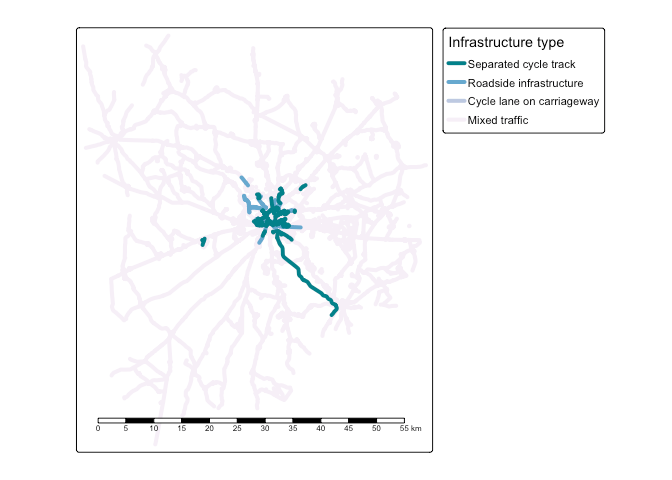

```{r, include = FALSE}
knitr::opts_chunk$set(
  collapse = TRUE,
  eval = FALSE
)
```

```{r setup}
remotes::install_dev("tmap")
library(spanishoddata)
library(tidyverse)
library(sf)
library(tmap)
```

# Introduction

This vignette serves as a place to showcase use cases of the package.
We'll start by loading a week's worth of origin-destination data for the city of Salamanca, building on the example in the README (note: these chunks are not evaluated):

```{r}
od_db <- spod_get_od(
  zones = "distritos",
  dates = c(start = "2024-03-01", end = "2024-03-07")
)
distritos <- spod_get_zones("distritos", ver = 2)
distritos_wgs84 <- distritos |>
  sf::st_simplify(dTolerance = 200) |>
  sf::st_transform(4326)
od_national_aggregated <- od_db |>
  group_by(id_origin, id_destination) |>
  summarise(Trips = sum(n_trips), .groups = "drop") |>
  filter(Trips > 500) |>
  collect() |>
  arrange(desc(Trips))
od_national_aggregated
od_national_interzonal <- od_national_aggregated |>
  filter(id_origin != id_destination)
salamanca_zones <- zonebuilder::zb_zone("Salamanca")
distritos_salamanca <- distritos_wgs84[salamanca_zones, ]
ids_salamanca <- distritos_salamanca$id
od_salamanca <- od_national_interzonal |>
  filter(id_origin %in% ids_salamanca) |>
  filter(id_destination %in% ids_salamanca) |>
  arrange(Trips)
od_salamanca_sf <- od::od_to_sf(
  od_salamanca,
  z = distritos_salamanca
)
```


# Disaggregating desire lines

For this you'll need some additional dependencies:

```{r}
remotes::install_github("dabreegster/odjitter", subdir = "r")
remotes::install_github("nptscot/osmactive")
```

We'll get the road network from OSM:

```{r}
#| results: hide
salamanca_boundary <- sf::st_union(distritos_salamanca)
osm_full <- osmactive::get_travel_network(salamanca_boundary)
```

```{r}
#| label: osm
osm <- osm_full[salamanca_boundary, ]
drive_net <- osmactive::get_driving_network(osm)
drive_net_major <- osmactive::get_driving_network_major(osm)
cycle_net <- osmactive::get_cycling_network(osm)
cycle_net <- osmactive::distance_to_road(cycle_net, drive_net_major)
cycle_net <- osmactive::classify_cycle_infrastructure(cycle_net)
map_net <- osmactive::plot_osm_tmap(cycle_net)
map_net
```



We can use the road network to disaggregate the desire lines:

```{r}
od_jittered <- odjitter::jitter(
  od_salamanca_sf,
  zones = distritos_salamanca,
  subpoints = drive_net,
  disaggregation_threshold = 1000,
  disaggregation_key = "Trips"
)
```

Let's plot the disaggregated desire lines:

```{r}
#| label: disaggregated
od_jittered |>
  arrange(Trips) |>
  ggplot() +
  geom_sf(aes(colour = Trips), size = 1) +
  scale_colour_viridis_c() +
  geom_sf(data = drive_net_major, colour = "black") +
  theme_void()
```


The results show that you can add value to the OD data by disaggregating the desire lines with the `odjitter` package.
This can be useful for understanding the spatial distribution of trips within a zone for transport planning.